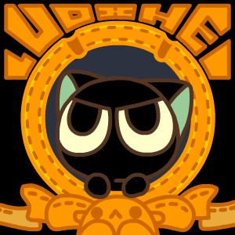

Hi  My name is VIVEK YADAV
====================================================================================================================================

<table>
<tr>
<td width="65%">

Full-Stack Developer focused on building scalable web applications, backend systems, cloud infrastructure, and AI-powered products.

- Backend Engineering
- System Design
- AI Applications
- Cloud Infrastructure

</td>

<td width="35%">

</td>
</tr>
</table>

I enjoy designing software that combines clean user experiences with reliable backend architecture. My work spans modern web development, distributed systems concepts, API design, cloud deployment, and AI integrations.

* 🌍  I'm based in LUCKNOW , UTTAR PRADESH
* 🖥️  See my portfolio at [Portfolio](http://vivekyadav-dev.vercel.app/)
* ✉️  You can contact me at [vivekyadav.dev007@gmail.com](mailto:vivekyadav.dev007@gmail.com)
* 🧠  I'm currently learning Currently exploring: Backend Architecture , System Design , Cloud Infrastructure , Machine Learning Engineering & Agentic AI Systems
* 💬  Ask me about I believe in understanding how systems work beneath the surface rather than simply learning frameworks.

### Socials

 <a href="https://www.github.com/VivekYadav-77" target="_blank" rel="noreferrer"> <picture> <source media="(prefers-color-scheme: dark)" srcset="https://raw.githubusercontent.com/danielcranney/readme-generator/main/public/icons/socials/github-dark.svg" /> <source media="(prefers-color-scheme: light)" srcset="https://raw.githubusercontent.com/danielcranney/readme-generator/main/public/icons/socials/github.svg" />  </picture> </a> <a href="https://www.linkedin.com/in/vivekyadav94/" target="_blank" rel="noreferrer"> <picture> <source media="(prefers-color-scheme: dark)" srcset="https://raw.githubusercontent.com/danielcranney/readme-generator/main/public/icons/socials/linkedin-dark.svg" /> <source media="(prefers-color-scheme: light)" srcset="https://raw.githubusercontent.com/danielcranney/readme-generator/main/public/icons/socials/linkedin.svg" />  </picture> </a>

<h2 align="center">📊 GitHub Stats</h2>

  

  

  

